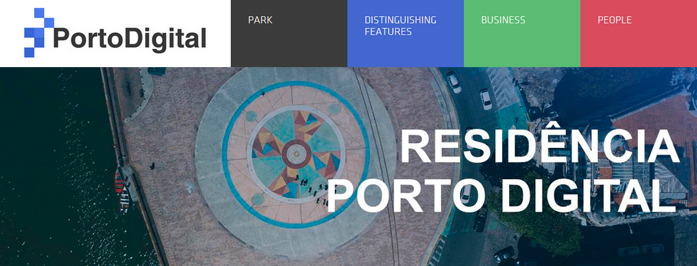

<h1 align="center">
  
</h1>

<h1 align="center">Porto Digital Residence: HTML, CSS and Bootstrap </h1>

## Project description

The Porto Digital Residency program is part of a teaching modality carried out with partner higher education institutions. With this initiative, students are encouraged, through practical actions, so that they are prepared to develop projects that solve real daily problems in the companies.

In other words, with the program, students have direct contact with companies and their challenges, making the learning process richer and in direct connection with the demands of the labor market.

HTML, CSS and Bootstrap.

- Starting the project.
- Inserting Header and Nav.
- Grid Bootstrap System.
- Adding text and image content.
- Custom styles.
- Finishing project with additional icons and styles.

### 🛠 Technologies

The following tools were used in the construction of the project:

- [HTML](https://developer.mozilla.org/pt-BR/docs/Web/HTML)
- [CSS](https://developer.mozilla.org/pt-BR/docs/Web/CSS)
- [Bootstrap](https://getbootstrap.com)
